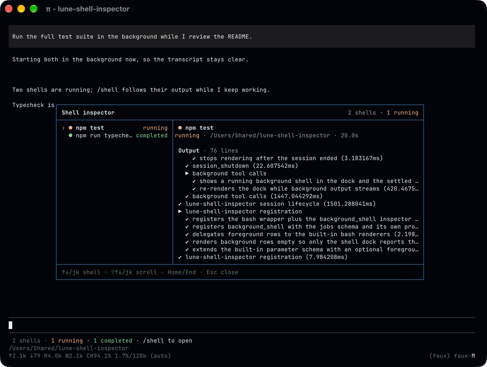

# Lune Shell Inspector



**Managed background shells for [Pi](https://pi.dev), with a live dock and an interactive `/shell` inspector.**

Lune Shell Inspector lets Pi keep long-running commands visible and manageable without changing the normal foreground `bash` experience. Commands that need an immediate result stay in the foreground; independent work can run in the background while the agent continues.

## What it does

- **Keeps foreground bash native.** Normal commands continue to use Pi's standard foreground behavior and transcript rendering.
- **Runs independent work in the background.** Background shell jobs return immediately so the agent can continue with other work.
- **Shows live shell status below the editor.** The dock summarizes running and settled jobs without taking over the transcript.
- **Adds an interactive `/shell` inspector.** Browse jobs, inspect status and metadata, and follow or scroll their terminal output.
- **Makes terminal output readable.** Progress bars, redraws, spinners, and other terminal-style output are rendered as a screen instead of raw escape sequences.
- **Lets the agent inspect background jobs.** The `background_shell` tool can query job status and, when needed, current output.
- **Returns completion to the agent.** When a background job finishes, fails, or is killed, the result is delivered back to the agent so it can react without constant polling.
- **Follows the Pi session.** Shell state is restored with the active session branch, and running jobs are stopped when their owning Pi session shuts down.

## Quick start

Install from GitHub:

```bash
pi install git:github.com/Nouvelle-Lune/lune-shell-inspector
```

Then start Pi normally:

```bash
pi
```

There is no separate shell mode to enter. The extension augments Pi's existing `bash` tool with foreground and background execution.

For example:

```text
Start the dev server in the background, then keep working on the feature.
```

or:

```text
Run this command in the foreground because I need the result before continuing.
```

## Shell dock

Background jobs appear in a compact status dock below the editor.

Examples:

```text
1 running shell · npm test · 12s · /shell to open
```

```text
5 shells · 3 running · 1 completed · 1 failed · /shell to open
```

The dock updates while jobs are running and disappears when there are no shell jobs to show.

## `/shell` inspector

Run:

```text
/shell
```

to open the shell inspector.

The job list stays on the left; the selected shell's command, status, working directory, duration, exit information, and terminal output appear on the right.

Keyboard controls:

| Action | Keys |
| --- | --- |
| Select shell | `↑` / `↓` or `k` / `j` |
| Scroll output | `Shift+↑` / `Shift+↓` or `Shift+k` / `Shift+j` |
| Jump to oldest output | `Home` |
| Follow newest output | `End` |
| Close inspector | `Esc` |

Output follows the newest lines by default. Scrolling upward pauses that follow behavior so new output does not pull the viewport away from what you are reading.

## Agent-facing tools

### `bash`

Foreground is the default. Background execution is intended for commands that can safely continue independently while the agent does other work.

### `background_shell`

The companion tool lets the agent:

- list managed background shells;
- query selected shell IDs;
- inspect status without loading output;
- request current output when it is actually needed.

## Development

```bash
npm install
npm test
npm run typecheck
npm run tui:demo
```

## Compatibility

Targets the Pi `0.86.x` API line.

## License

MIT
